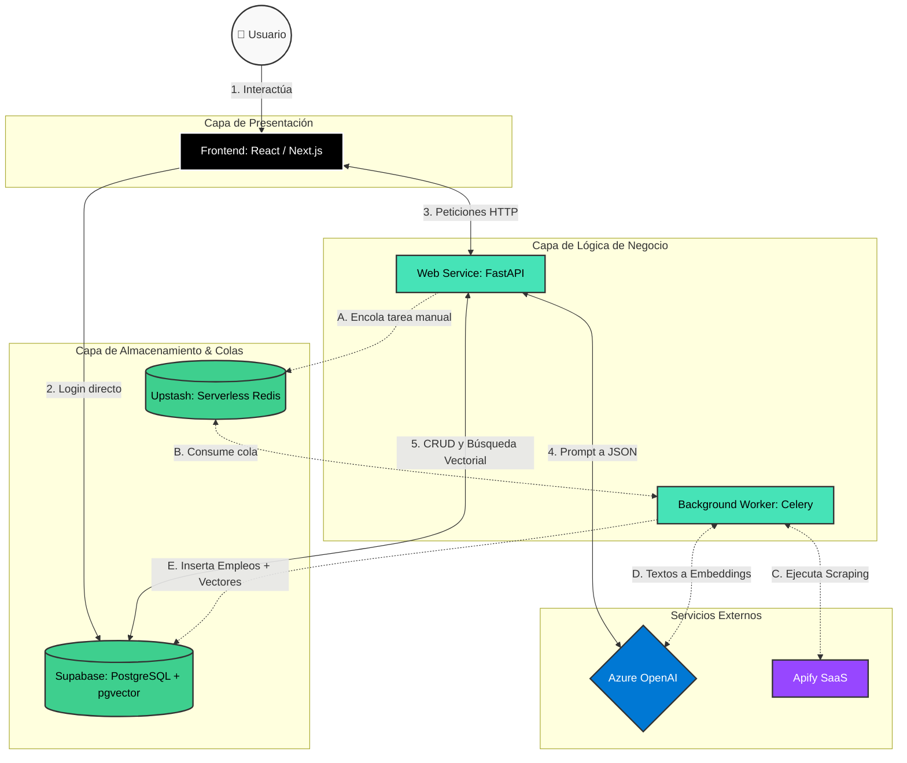

# AGENTS.md

## Proyecto

Este repositorio corresponde a una aplicación web inteligente orientada a mejorar la búsqueda laboral mediante IA. El producto tiene dos etapas claramente diferenciadas:

1. MVP: generador de CV con IA, enfocado en transformar texto no estructurado en un currículum bien formateado, listo para ATS y para humanos.
2. Producto final: matcher de empleos, que combina perfiles profesionales, ofertas laborales y análisis de afinidad para sugerir oportunidades relevantes y ayudar en la postulación.

La aplicación debe pensarse como una solución full-stack con frontend, backend, base de datos y servicios de IA, con una arquitectura preparada para crecer desde un MVP funcional hacia un agente automatizado de matching laboral.

---

## Visión del producto

La plataforma debe ayudar a la persona a:

- transformar su experiencia profesional en un CV profesional y consistente;
- generar versiones del CV optimizadas para distintos usos;
- extraer información clave de textos libres y no estructurados;
- comparar su perfil contra ofertas reales de empleo;
- recibir feedback inteligente sobre match, fortalezas y vacíos de perfil;
- descargar versiones finales en formatos listos para uso profesional.

---

## Features del proyecto

### Feature F1: Autenticación y gestión de usuarios

**Descripción:** permitir que cada usuario cree su cuenta, inicie sesión y acceda a su panel personal con sus CVs y resultados de matching.

**Criterios de aceptación:**

- El usuario puede registrarse con email y contraseña o con un proveedor externo si se habilita.
- El usuario puede iniciar sesión y cerrar sesión de forma segura.
- Cada usuario solo ve y modifica sus propios datos.
- La sesión se mantiene de forma segura en la aplicación web.

### Feature F2: Ingesta y carga de perfil profesional

**Descripción:** permitir al usuario ingresar su experiencia laboral, educación, habilidades y biografía en texto libre o mediante carga de información estructurada.

**Criterios de aceptación:**

- El usuario puede ingresar texto libre en un formulario o textarea.
- El usuario puede complementar su perfil con información adicional manualmente.
- La información se guarda asociada al usuario autenticado.
- El sistema valida campos obligatorios y formato básico de datos.

### Feature F3: Generación automática de CV con IA

**Descripción:** transformar el texto del usuario en un CV estructurado, consistente y optimizado para ATS y para lectura humana.

**Criterios de aceptación:**

- El backend envía el perfil a un modelo de IA con un prompt estructurado.
- La respuesta del modelo debe estar en formato JSON válido y consistente.
- El sistema valida la salida antes de persistirla o renderizarla.
- El CV generado incluye experiencia, educación, habilidades y logros cuantificados.

### Feature F4: Motor de plantillas y visualización del CV

**Descripción:** recibir el JSON del CV y renderizarlo usando distintas plantillas visuales según el tipo de documento requerido.

**Criterios de aceptación:**

- El sistema permite seleccionar al menos dos plantillas: ATS y visual/humana.
- La aplicación muestra una vista previa del CV antes de exportarlo.
- El diseño es legible, ordenado y consistente con el contenido estructurado.
- El usuario puede cambiar de plantilla sin perder la información base.

### Feature F5: Exportación a PDF

**Descripción:** permitir al usuario descargar el CV final en formato PDF listo para uso profesional.

**Criterios de aceptación:**

- El usuario puede generar el PDF desde la vista previa del CV.
- El archivo se descarga correctamente en el navegador.
- El documento mantiene el formato y la estructura de la plantilla elegida.
- La exportación funciona con contenido mínimo y con perfiles más completos.

### Feature F6: Recolección y almacenamiento de ofertas laborales

**Descripción:** capturar ofertas de trabajo desde fuentes configuradas y almacenarlas para su posterior comparación con perfiles de usuario.

**Criterios de aceptación:**

- El sistema puede consumir ofertas desde APIs o scraping controlado.
- Las ofertas se guardan con datos clave: título, empresa, ubicación, descripción, requisitos y fecha.
- Los datos se almacenan de forma estructurada para posterior análisis.
- El sistema evita duplicados de ofertas.

### Feature F7: Matching de perfil vs oferta mediante IA y embeddings

**Descripción:** comparar el perfil del usuario con la oferta laboral usando embeddings y similitud semántica para calcular afinidad.

**Criterios de aceptación:**

- El CV estructurado y la oferta se convierten a embeddings.
- El sistema calcula un score de coincidencia entre ambos.
- El ranking de ofertas es ordenado por afinidad.
- El sistema devuelve resultados útiles y comprensibles para el usuario.

### Feature F8: Feedback inteligente y recomendaciones

**Descripción:** explicar por qué una oferta es relevante o qué habilidades faltan para aumentar la probabilidad de match.

**Criterios de aceptación:**

- El usuario ve un resumen breve de por qué la oferta encaja con su perfil.
- El sistema identifica skills faltantes o débiles.
- Las recomendaciones son claras y accionables.
- La respuesta generada por IA es legible y contextualizada para el usuario.

### Feature F9: Dashboard de oportunidades laborables

**Descripción:** mostrar al usuario las oportunidades que mejor encajan con su perfil y un historial de resultados.

**Criterios de aceptación:**

- El usuario accede a una lista de ofertas sugeridas.
- Cada oferta muestra título, empresa, match score y resumen.
- El usuario puede filtrar por industria, ubicación o tipo de empleo.
- El usuario puede guardar o marcar ofertas de interés.

### Feature F10: Tareas asíncronas y procesamiento en background

**Descripción:** ejecutar scrapers, cargas masivas y procesos de IA sin bloquear la experiencia del usuario.

**Criterios de aceptación:**

- Las tareas pesadas se ejecutan en segundo plano.
- El usuario puede seguir navegando sin esperar la finalización.
- El sistema informa el estado de la tarea si aplica.
- Los jobs se gestionan de forma robusta y con reintentos controlados.

---

## Historias de usuario

### MVP: Generador de CV con IA

#### US-01: Registro e inicio de sesión

Como usuario nuevo, quiero crear una cuenta e iniciar sesión, para guardar mi perfil y mis CVs de forma segura.

**Criterios de aceptación:**

- Puedo registrarme con email y contraseña.
- Puedo iniciar sesión con mis credenciales.
- Si los datos son inválidos, veo un mensaje claro.
- Si estoy autenticado, puedo acceder a mi panel privado.

#### US-02: Ingreso de información profesional

Como usuario, quiero ingresar mi experiencia laboral y mi formación, para que la IA pueda crear un CV profesional.

**Criterios de aceptación:**

- Puedo escribir mi resumen profesional y experiencia en texto libre.
- Puedo completar secciones de educación, habilidades y logros.
- Mis datos se guardan correctamente en mi perfil.
- La interfaz valida datos requeridos antes de continuar.

#### US-03: Generación del CV con IA

Como usuario, quiero que el sistema transforme mi perfil en un CV estructurado, para ahorrar tiempo y mejorar la presentación profesional.

**Criterios de aceptación:**

- El sistema genera un CV a partir de mi información.
- La respuesta del modelo se guarda como JSON validado.
- El usuario puede revisar el contenido generado.
- El CV incluye secciones principales y redacciones orientadas a logros.

#### US-04: Selección de plantillas

Como usuario, quiero elegir una plantilla para mi CV, para adaptarlo a distintos usos y públicos.

**Criterios de aceptación:**

- Hay al menos dos plantillas disponibles.
- El usuario puede cambiar de plantilla fácilmente.
- La vista previa refleja los cambios realizados.
- La plantilla elegida se conserva en la sesión del usuario.

#### US-05: Descarga del CV como PDF

Como usuario, quiero descargar mi CV en PDF, para compartirlo o enviarlo a empleadores.

**Criterios de aceptación:**

- El usuario puede exportar el CV final como PDF.
- El archivo se descarga correctamente.
- El PDF mantiene el diseño de la plantilla seleccionada.
- El documento se ve legible y profesional.

### Etapa final: Matcher de empleos

#### US-06: Visualización de ofertas recomendadas

Como usuario, quiero ver ofertas que coincidan con mi perfil, para encontrar trabajos relevantes más rápido.

**Criterios de aceptación:**

- El sistema muestra una lista de ofertas sugeridas.
- Cada oferta incluye título, empresa, ubicación y score de match.
- Las ofertas están ordenadas por relevancia.
- El usuario puede abrir cada detalle de la oferta.

#### US-07: Comparación de perfil y puesto

Como usuario, quiero ver un análisis de compatibilidad entre mi CV y la oferta, para entender por qué encaja o no.

**Criterios de aceptación:**

- El sistema presenta un resumen de afinidad.
- Se indican habilidades coincidentes y faltantes.
- La explicación es comprensible y no técnica.
- El usuario puede comparar su perfil con un puesto específico.

#### US-08: Guardar oportunidades de interés

Como usuario, quiero guardar ofertas que me interesen, para revisarlas después sin perderlas de vista.

**Criterios de aceptación:**

- El usuario puede guardar una oferta.
- Las ofertas guardadas aparecen en una sección propia.
- El usuario puede quitar una oferta de sus favoritos.
- El sistema refleja el estado actualizado en la interfaz.

#### US-09: Recomendaciones de mejora profesional

Como usuario, quiero recibir recomendaciones para mejorar mi perfil, para aumentar mis posibilidades de conseguir una entrevista.

**Criterios de aceptación:**

- El sistema identifica brechas con respecto a las ofertas relevantes.
- Sugiere habilidades o certificaciones para fortalecer el perfil.
- Las recomendaciones son concretas y accionables.
- El usuario puede aplicar esas recomendaciones al perfil o CV.

#### US-10: Ejecución de tareas en segundo plano

Como usuario, quiero que la app procese información de forma asíncrona, para no esperar largas tareas de scraping o análisis.

**Criterios de aceptación:**

- El sistema realiza tareas pesadas en background.
- La UI permanece operativa durante el procesamiento.
- El usuario recibe feedback de progreso o completitud cuando corresponda.
- Los errores de tareas se registran y gestionan adecuadamente.

---

## Priorización sugerida

### P0 - MVP obligatorio

- F1 Autenticación y gestión de usuarios
- F2 Ingesta y carga de perfil profesional
- F3 Generación automática de CV con IA
- F4 Motor de plantillas y visualización del CV
- F5 Exportación a PDF

### P1 - Funcionalidad de valor agregado

- F6 Recolección y almacenamiento de ofertas laborales
- F7 Matching de perfil vs oferta
- F8 Feedback inteligente y recomendaciones
- F9 Dashboard de oportunidades laborales

### P2 - Optimización y escalabilidad

- F10 Tareas asíncronas y procesamiento en background

---

## Etapa 1: MVP - Generador de CV con IA

El objetivo principal del MVP es ingerir texto libre y devolver un documento perfectamente formateado, con dos versiones:

- versión orientada a ATS (Applicant Tracking Systems), priorizando texto limpio y estructurado;
- versión visual para humanos, con mejor diseño y presentación.

### Funcionalidades requeridas

- Login y gestión de usuarios.
- Ingesta de datos: el usuario debe poder ingresar su biografía, experiencia laboral e historial académico en texto libre.
- Procesamiento con LLM: el modelo debe extraer entidades clave, como experiencia, educación, habilidades blandas y duras, y redactar bullet points orientados a logros.
- El resultado del modelo debe forzarse a un formato JSON estricto, validado antes de guardarse o renderizarse.
- Motor de plantillas: el JSON generado alimenta componentes visuales según la plantilla seleccionada (por ejemplo: Minimalista ATS, Creativo PDF).
- Exportación: el CV final debe poder renderizarse en PDF descargable desde la interfaz.

### Requisitos de implementación

- Toda extracción de datos debe ser estructurada y consistente con un esquema definido.
- Los prompts del modelo deben priorizar precisión, JSON válido y ausencia de contenido no solicitado.
- El backend debe validar el payload antes de almacenarlo o devolverlo al frontend.
- La interfaz debe permitir revisar el CV generado antes de descargarlo.

---

## Etapa 2: Desarrollo final - Matcher de empleos

La segunda etapa transforma la aplicación de un generador de CV a un agente automatizado de búsqueda laboral.

### Funcionalidades clave

- Recolección de ofertas: integración con APIs de empleo o scraping controlado de descripciones de puestos.
- Procesamiento vectorial: transformar el CV estructurado y las ofertas de empleo en embeddings.
- Motor de similitud: calcular la afinidad entre el perfil del usuario y las ofertas, devolviendo un score de coincidencia.
- Feedback de IA: explicar por qué hay match y qué habilidades faltan para ese puesto en particular.

### Objetivos del sistema final

- Buscar ofertas relevantes sin bloquear la experiencia del usuario.
- Ejecutar tareas en segundo plano de forma asíncrona.
- Mantener un historial de ofertas y resultados de matching.
- Priorizar una experiencia de usuario fluida, con resultados generados en background y mostrados cuando estén listos.

---

## Stack tecnológico

| Componente          | Tecnología                       | Despliegue             | Justificación                                                                          |
| :------------------ | :------------------------------- | :--------------------- | :------------------------------------------------------------------------------------- |
| Frontend            | React / Next.js                  | Vercel                 | Excelente para interfaces interactivas y renderizado de documentos a PDF en navegador. |
| Backend             | Python (FastAPI)                 | Render                 | Ligero, asíncrono y muy adecuado para servicios de IA.                                 |
| Base de datos MVP   | PostgreSQL                       | Supabase               | Estructurada para guardar usuarios, históricos y JSON de CV.                           |
| Modelo IA           | OpenAI API (GPT-4o) / Claude 3.5 | Azure                  | Muy buenos para extracción de datos estructurados y obediencia a prompts complejos.    |
| Base de datos final | PostgreSQL + pgvector            | Supabase               | Necesaria para búsquedas vectoriales por similitud.                                    |
| Scraping / tareas   | Apify + Celery / Redis           | Apify, Upstash, Render | Soporta extracción automatizada y ejecución de tareas largas en background.            |

---

## Arquitectura y despliegue

### Frontend

- Se aloja en Vercel.
- Maneja la experiencia web del usuario.
- Controla la interfaz de ingreso de datos, selección de plantillas y descarga del PDF.
- Se recomienda evitar que el backend haga trabajo visual complejo; el frontend debe encargarse del render final de la plantilla.

### Base de datos y autenticación

- Supabase debe encargarse del login de usuarios.
- Debe almacenar los datos estructurados de cada currículum.
- En la etapa final, debe soportar extensiones vectoriales para búsquedas por similitud.

### IA

- Azure OpenAI será el proveedor principal para generar la estructura del CV y los embeddings de ofertas.
- Los modelos deben usarse con prompts explicitamente definidos para evitar salidas libres o inconsistentes.

### Backend

- FastAPI actúa como orquestador principal.
- Recibe solicitudes del frontend.
- Se comunica con modelos de IA y bases de datos.
- Debe tener endpoints claros y bien definidos para cada operación principal.

### Background jobs

- Las tareas largas como scraping o procesamiento masivo deben ejecutarse fuera del ciclo de petición del usuario.
- Celery + Redis o infraestructura equivalente debe usarse para encolar y ejecutar estas tareas asíncronamente.

---

## Flujos de arquitectura

### Etapa 1 - flujo sincrónico

1. El usuario inicia sesión y pega su texto descriptivo en la web.
2. El frontend envía esa información al backend mediante un endpoint de FastAPI.
3. El backend consulta a Azure con un sistema de prompts estricto.
4. El modelo responde únicamente con JSON estructurado.
5. El backend valida el JSON y lo guarda asociado al usuario.
6. El frontend renderiza la plantilla elegida y permite la descarga del PDF.

### Etapa 2 - flujo asincrónico

1. Un worker de Python extrae empleos periódicamente desde fuentes públicas o APIs.
2. Los textos de las ofertas se convierten en embeddings mediante Azure.
3. Los empleos y sus embeddings se guardan en PostgreSQL con pgvector.
4. Cuando el usuario consulta el sistema, el CV se convierte en embedding y se compara con las ofertas.
5. Supabase devuelve los puestos mejor clasificados según similitud.
6. El sistema genera una explicación de match o de habilidades faltantes para ese perfil.

---

## Diagrama de componentes

---

## Principios de desarrollo

- No instalar dependencias sin consultar previamente al usuario.
- Mantener una separación clara entre frontend, backend, almacenamiento y servicios externos.
- Priorizar la modularidad y la mantenibilidad del código.
- El modelo de IA no debe devolver texto libre cuando se espera un JSON estricto.
- Validar siempre que los datos ingresados por el usuario sean coerentes con el flujo de negocio.
- Las tareas pesadas deben ejecutarse en background.
- La experiencia del usuario debe seguir siendo rápida incluso cuando el sistema realiza procesamiento avanzado.
- Los secretos, claves de API y tokens no deben estar en el repositorio ni en archivos de configuración compartidos.

---

## Reglas operativas para el repositorio

- Agregar `data-testid` a todo elemento que una prueba necesite identificar.
- Mantener nombres de componentes, endpoints y tablas consistentes con el dominio del negocio.
- Documentar cambios importantes del flujo de IA o de la estructura del CV.
- Preferir prompts claros y acotados para evitar respuestas ambiguas del modelo.
- Cuando se trabaje con scraping o extracción automática, cuidar la legalidad, la tasa de requests y la calidad del contenido extraído.

---

## Definition of done

Una tarea se considera completada cuando:

- cumple con el objetivo funcional definido para la etapa actual;
- se valida la integración con la capa correspondiente (frontend/backend/IA/base de datos);
- se respetan las reglas de arquitectura y seguridad del proyecto;
- la salida del sistema es consistente con el esperado por el usuario final;
- no se introduce deuda técnica significativa sin documentarla.

---

## Resumen ejecutivo

El proyecto avanza en dos pasos: primero, convertir texto libre en CV profesional y exportable; segundo, añadir un motor de matching laboral basado en IA y embeddings. La base tecnológica recomendada es React/Next.js para frontend, FastAPI para backend, PostgreSQL con pgvector para almacenamiento vectorial, Azure OpenAI para IA y servicios de background como Celery/Redis para tareas asíncronas.

Este repositorio debe mantenerse alineado con esa visión y priorizar un producto útil, escalable y preparado para evolucionar desde un MVP funcional hasta una plataforma inteligente de búsqueda laboral.
