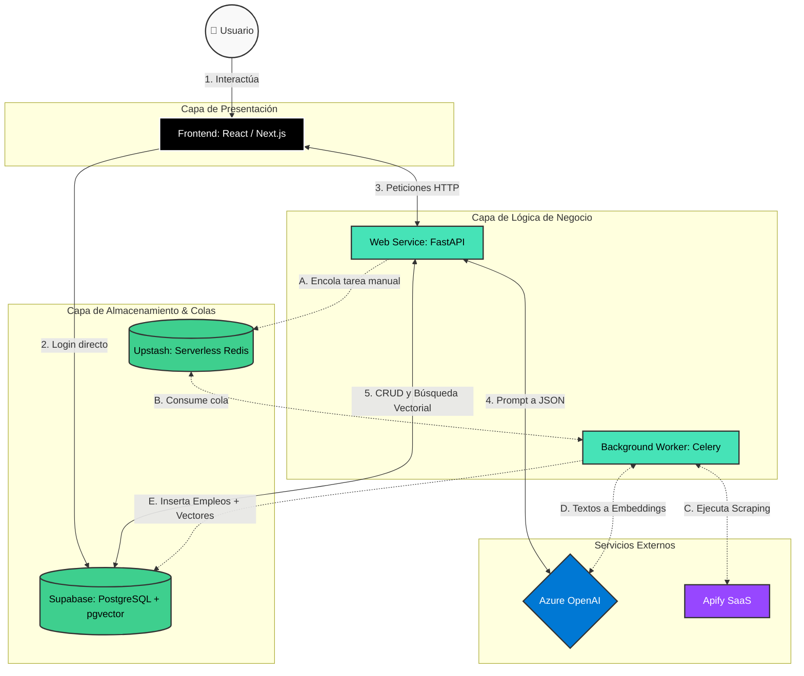

# Proyecto: Generador de CV con IA y Matcher de Empleos

Vamos a dividir el desarrollo en 2 etapas: primero un MVP y luego un desarrollo final.

## Etapa 1: MVP - Generador de CV con IA
El objetivo central es ingerir texto no estructurado y devolver un documento perfectamente formateado, con versiones puramente textuales para los Applicant Tracking Systems (ATS) y versiones con diseño para humanos.

*   **Login:** Gestión de acceso de usuarios.
*   **Ingesta de datos:** Interfaz donde el usuario ingresa su biografía e historia laboral en texto libre.
*   **Procesamiento LLM:** Un modelo de lenguaje extrae entidades (experiencia, educación, habilidades blandas y duras) y redacta *bullet points* orientados a logros. La salida del LLM debe ser forzada estrictamente a un formato JSON.
*   **Motor de Plantillas:** El JSON alimenta componentes de interfaz de usuario correspondientes a distintas plantillas (ej. "Minimalista ATS", "Creativo PDF").
*   **Exportación:** Renderizado del componente visual a un archivo PDF descargable.

## Etapa 2: Desarrollo Final - Matcher de Empleos
Aquí el sistema pasa de ser una herramienta de formato a un agente automatizado. Se requiere infraestructura en segundo plano para buscar y evaluar ofertas sin bloquear la experiencia del usuario web.

*   **Recolección de ofertas:** Integración con APIs de sitios de empleo o web scraping controlado de descripciones de puestos (Job Descriptions).
*   **Procesamiento Vectorial:** Transformar tanto el CV estructurado del usuario como las ofertas de empleo en *embeddings* (vectores numéricos de alta dimensionalidad).
*   **Motor de Similitud:** Calcular la distancia entre el vector del perfil y los vectores de las ofertas para devolver un "Score de afinidad" (ej. 85% de coincidencia).
*   **Feedback de IA:** Generar un análisis breve indicando por qué el perfil hace match o qué habilidades clave le faltan para esa oferta en particular.

## Stack Tecnológico

| Componente | Tecnología | Despliegue | Justificación |
| :--- | :--- | :--- | :--- |
| **Frontend** | React / Next.js | Vercel | Excelente para crear interfaces interactivas y manejar el renderizado directo a PDF en el navegador con librerías como `@react-pdf/renderer`. |
| **Backend** | Python (FastAPI) | Render | Python es el estándar de la industria para IA. FastAPI es ligero, asíncrono y excelente para manejar llamadas a modelos de lenguaje. |
| **Base de datos (MVP)** | PostgreSQL | Supabase | Robusta y estructurada para guardar usuarios, historiales y los JSON generados de los currículums. |
| **Modelo IA** | OpenAI API (GPT-4o) / Claude 3.5 | Azure | Superiores para extraer datos estructurados y seguir instrucciones complejas de formateo de CVs. |
| **Base de datos (Final)**| PostgreSQL con `pgvector` | Supabase | Base de datos vectorial esencial para almacenar embeddings de ofertas y hacer la búsqueda por similitud en milisegundos. |
| **Scraping / Tareas** | Apify + Celery/Redis | Apify (SaaS) / Upstash (Redis) / Render (Celery) | Apify gestiona la extracción automatizada; Celery maneja la ejecución de las tareas largas en segundo plano. |

## Despliegue

*   **Front-end (Vercel):** Alojará la aplicación en React/Next.js. Se encargará de la interfaz, el renderizado de las plantillas y la generación del PDF en el lado del cliente (para no saturar el servidor).
*   **Base de Datos y Autenticación (Supabase):** Manejará el login de usuarios, almacenará el JSON estructurado de cada currículum y, en la Etapa 2, usará la extensión `pgvector` para la búsqueda de similitud.
*   **Inteligencia Artificial (Azure):** A través de Azure OpenAI Service (ideal para cuentas estudiantiles), consumirán los modelos GPT para estructurar el texto del usuario y generar los *embeddings* de los trabajos.
*   **Backend (Render):** Un servicio web en Python (FastAPI) que actuará como orquestador. Recibirá las peticiones del front, se comunicará con Azure para procesar la IA y guardará/leerá datos en Supabase.

## Flujos de Arquitectura

### Etapa 1 (MVP) - Flujo Sincrónico
1.  **Ingreso (Vercel):** El usuario se loguea (vía Supabase Auth) y pega su texto descriptivo en la web.
2.  **Petición (Render):** El front envía el texto a un endpoint de FastAPI (ej. `/api/generate-cv`).
3.  **Procesamiento IA (Azure):** FastAPI envía el texto al modelo desplegado en Azure con un System Prompt estricto para que extraiga la información y la devuelva exclusivamente en formato JSON.
4.  **Almacenamiento (Supabase):** FastAPI recibe el JSON, lo valida y lo guarda en la tabla `resumes` vinculada a ese usuario.
5.  **Renderizado (Vercel):** FastAPI devuelve el JSON al front. React inyecta esos datos en la plantilla seleccionada y permite descargar el PDF.

### Etapa 2 (Desarrollo Final) - Flujo Asincrónico
1.  **Ingesta de Empleos (Render Background Worker):** Un script en Python corre periódicamente (ej. cada 12 horas) extrayendo Job Descriptions de sitios de empleo.
2.  **Vectorización (Azure + Render):** Por cada empleo nuevo, Render pide a Azure un Embedding (una representación matemática del texto del empleo).
3.  **Almacenamiento Vectorial (Supabase):** El empleo y su embedding se guardan en una tabla en Supabase usando `pgvector`.
4.  **El Matching (Render + Supabase):** Cuando el usuario entra a la app, FastAPI toma el JSON de su CV, pide a Azure que lo convierta en un embedding, y hace una consulta SQL a Supabase ordenando los empleos por distancia vectorial (similitud del coseno). Los empleos más afines aparecen primero.

## Diagrama de Componentes

